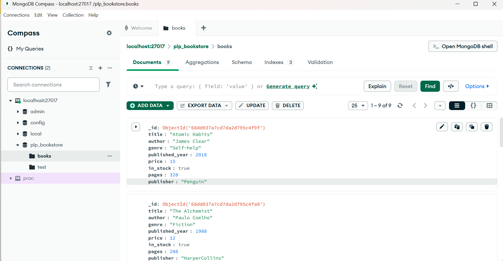

# MongoDB Fundamentals - Week 1 Assignment

This project demonstrates how to use **MongoDB with Node.js** to perform:
- CRUD operations
- Advanced queries
- Aggregations
- Indexing

The database used is **plp_bookstore** with a `books` collection.

---

## 📦 Setup Instructions

### 1. Clone this Repository
```bash
git clone <https://github.com/PLP-MERN-Stack-Development/mongodb-data-layer-fundamentals-and-advanced-techniques-graceakhati-dev.git>

cd mongodb-data-layer-fundamentals-and-advanced-techniques-graceakhati-dev

2. Install Dependencies
npm install

3. Configure MongoDB Connection

Ensure MongoDB is installed and running locally (mongod).

Update the connection string in connect.js or queries.js if necessary:

const uri = "mongodb://127.0.0.1:27017";

4. Run Scripts

Insert sample books

node insert.js


Run queries, aggregations, indexes

node queries.js

5. View Data in Compass

Open MongoDB Compass

Connect to:

mongodb://127.0.0.1:27017


Navigate to:

plp_bookstore > books

📸 Screenshots
MongoDB Compass (books collection)

Terminal output

Example from running node queries.js:

✅ Connected to plp_bookstore
📚 Fiction Books: [...]
📚 Books after 2010: [...]
✅ Updated price of 1984
🗑️ Deleted Rich Dad Poor Dad
⚡ Created index on title
⚡ Created compound index on author + published_year
📊 Aggregation results: [...]

🛠 Features Covered

CRUD

Insert, find, update, delete

Advanced Queries

Filtering, projection, sorting, pagination

Aggregations

Average price, grouping by decade, counting books per author

Indexes

Single-field and compound indexes with performance check using explain()

✅ Tasks Completed

Task 1: Setup + sample data

Task 2: CRUD

Task 3: Advanced queries

Task 4: Aggregations

Task 5: Indexing

## MongoDB Compass Screenshot

Here is the screenshot of my `plp_bookstore.books` collection:




👩‍💻 Author

Grace Akhati
PLP Cohort July 2025
